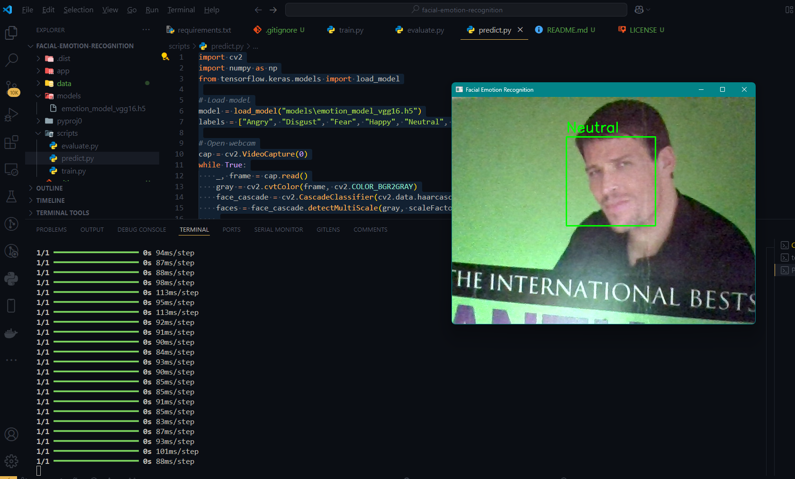

# Facial Emotion Recognition using CNN

##  Overview
This project implements a **Facial Emotion Recognition** system using **Convolutional Neural Networks (CNNs)**. The model classifies human facial expressions into different emotions such as **Happy, Sad, Angry, Surprised, Neutral, Fear, and Disgust**.

## 📂 Project Structure
```
facial_emotion_recognition/
│-- data/                   # Directory for dataset (train/test images)
│-- models/                 # Saved trained models
│-- scripts/                # Source code for training and evaluation
│   │-- train.py            # Training script
│   │-- evaluate.py         # Model evaluation
│   │-- predict.py          # Real-time emotion detection (optional)
│-- requirements.txt        # List of dependencies
│-- README.md               # Project documentation
│-- app.py                  # Streamlit web app for emotion detection
```

## 📊 Dataset
The **FER2013 dataset** is used for training and evaluation. It comprises **35,887 grayscale images (48x48 pixels)** of human faces, labeled into seven emotion classes:

- **Angry** 
- **Disgust** 
- **Fear** 
- **Happy** 
- **Neutral**
- **Sad** 
- **Surprise** 

### 🔹 Dataset Structure
```
data/
│-- train/
│   │-- angry/
│   │-- disgust/
│   │-- fear/
│   │-- happy/
│   │-- neutral/
│   │-- sad/
│   │-- surprise/
│-- test/
```

### 🔹 Download the Dataset
Run the following command to download the dataset from Kaggle:
```sh
kaggle datasets download -d msambare/fer2013
```
Then extract it:
```sh
unzip fer2013.zip -d data/
```

## ⚙️ Installation
### 1️⃣ Clone the Repository
```sh
git clone https://github.com/4yamneBH/facial-emotion-recognition.git
cd facial-emotion-recognition
```
### 2️⃣ Create a Virtual Environment
```sh
python -m venv env
# On Windows:
env\Scripts\activate  
# On macOS/Linux:
source env/bin/activate
```
### 3️⃣ Install Dependencies
```sh
pip install -r requirements.txt
```

##  Model Architecture
The project implements a **VGG16-based model**, fine-tuned for emotion classification.

### 🔹 Key Features:
✔ Pre-trained **VGG16 backbone** for feature extraction  
✔ Additional **Dense layers** for classification  
✔ **Dropout layers** to prevent overfitting  
✔ Optimized with **Adam optimizer** and **categorical cross-entropy loss**  

### 🔹 Model Summary:
```python
model = tf.keras.models.Sequential([
    vgg16_model,  # Pre-trained VGG16 model
    layers.Flatten(),
    layers.Dense(128, activation='relu'),
    layers.Dropout(0.5),
    layers.Dense(7, activation='softmax')  # 7 emotion classes
])
```

##  Training the Model
Run the following command to train the model:
```sh
python scripts/train.py
```

## 📈 Results & Performance
| Model              | Validation Accuracy | Training Accuracy |
|--------------------|--------------------|-------------------|
| Custom CNN        | ~38%               | ~50%              |
| VGG16 (Fine-tuned)| ~70%               | ~85%              |

🔹 **VGG16 significantly outperformed the custom CNN** due to its powerful feature extraction capabilities.  
🔹 **Training loss and validation loss stabilized**, reducing overfitting.

##  Real-Time Emotion Detection
To use the model for **real-time emotion recognition** via webcam, run:
```sh
python scripts/predict.py
```

## 🌐 Web Application
A **Streamlit web app** is included for easy emotion recognition using uploaded images.
### Run the app using:
```sh
streamlit run app.py
```
### Features:
- Upload an image and get emotion predictions.
- Displays **confidence scores** for each emotion class.

## 📜 License
This project is open-source and available under the **MIT License**.

---
💡 **Contributions & Feedback** are welcome! Feel free to open an issue or submit a pull request. 

